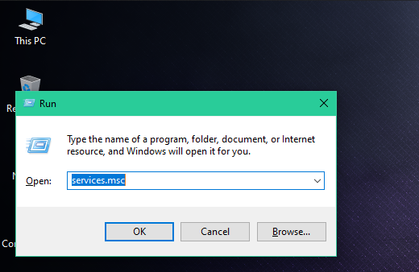
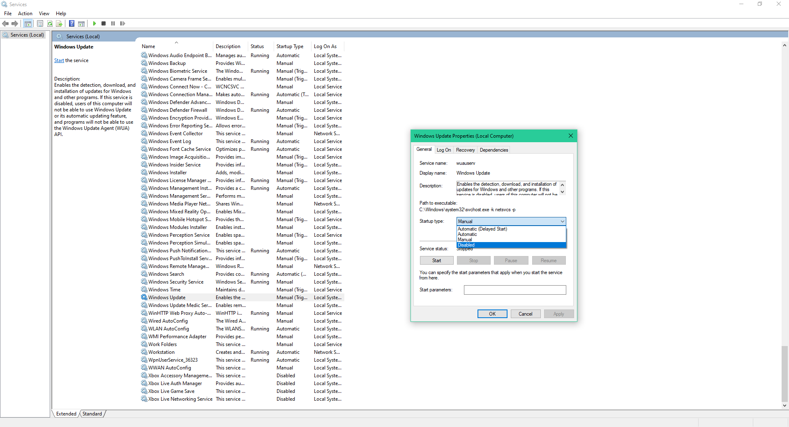
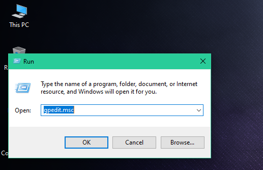
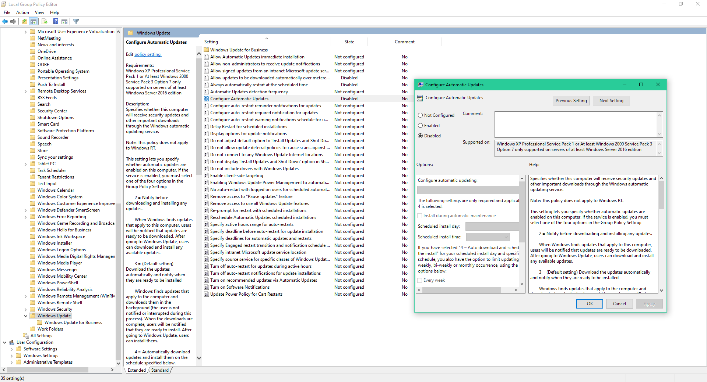
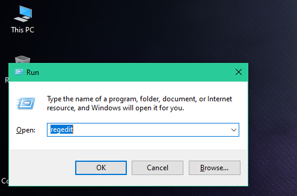
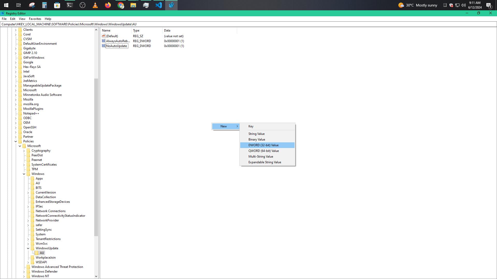
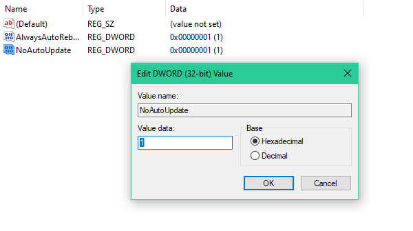
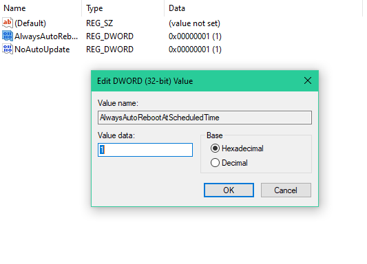

# Turn Off Windows 10/11 Auto Update Permanently

  
  
  

  
  

## [+] My Links

 

 

## $ Step - 01
- Press `Windows+R`
- Now Type `services.msc` and press OK

 

- Now go to `Windows Update`
- Then Select *Startup type:* `Disabled` and press OK

   

## $ Step - 02
- Press `Windows+R`
- Now Type `gpedit.msc` and press OK

 

- Now go to  
`Computer Configuration > Administrative Templates > Windows Components > Windows Update >`*`Configure Automatic Updates`*
- Then Select `Disabled` and press OK

   

## $ Step - 03
- Press `Windows+R`
- Now Type `regedit` and press OK

 

- Now go to  
`Computer\HKEY_LOCAL_MACHINE\SOFTWARE\Policies\Microsoft\Windows\WindowsUpdate`
- Then Create Folder named `AU` if it doesn't exist

- Then Create File `NoAutoUpdate` and set Hexadecimal Value `1` for it and press OK

- Then also set `AlwaysAutoRebootAtScheduledTime` Hex Value `1`

- Now you are all Done Turning off Windows Auto Update Permanently!
